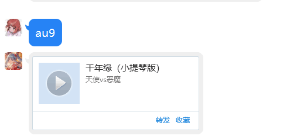
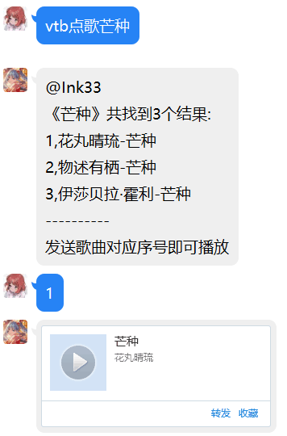
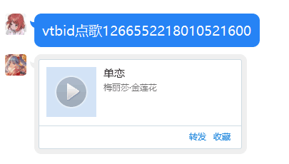
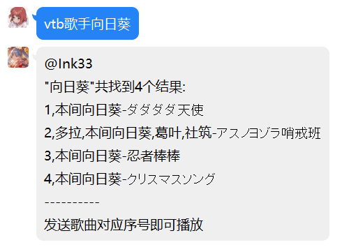
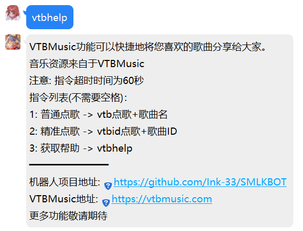

# SMLKBOT
SMLKBOT是基于[CQHTTPAPI](https://github.com/richardchien/coolq-http-api)的一个聚合群聊娱乐机器人后端程序  

## 1,功能
以下功能未特别说明的均已实装，并可以通过修改配置文件进行独立开关  


### 1.1, Bilibili
**注意：部分功能需要CQP**
已实装：
提取聊天中的au号,然后返回音频分享卡片。  
效果：  
  

*注:不显示图片是TIM特性,图片均能在移动端QQ正常显示*  
未实装：
avid,bvid解析
ep,cv解析

### 1.2, VTBMusic
**注意：本功能需要CQP**  
VTBMusic功能可以快捷地将您喜欢的歌曲分享给大家。所有音乐资源均来自于VTBMusic，请确认您要分享的歌曲已在VTBMusic正常上架。  

注意: 指令超时时间为**60秒**  

指令列表(不需要空格)：
```  
1: 普通点歌 -> vtb点歌+歌曲名
```
效果：  
 
```  
2: 精准点歌 -> vtbid点歌+歌曲ID  
```
效果：  
 
```
3: 歌手点歌 -> vtb歌手+歌手名  
```
效果：  
 
```
4: 获取帮助 -> vtbhelp
```
效果：  
  

*注:不显示图片是TIM特性,图片均能在移动端QQ正常显示*

## 2,配置
将`conf.example.json`重命名为`conf.json`  
以下为完整示例文件  
```json
{
    "CoolQ": {
        "master":[
            "123"
        ],
        "Api": {
            "": {
                "HTTPAPIAddr": "",
                "HTTPAPIToken": "",
                "HTTPAPIPostSecret": ""
            }
        },
        "HTTPServer": {
            "ListeningPath": "/api/cqmsg",
            "ListeningPort": 12345
        }
    },
    "Feature": [
        {
            "Bilibili": true,
            "VTBMusic": true
        }
    ]
}
```  
#### 解析：Master
master代表机器人的所有者,拥有SmlkShell的最高权限  
数据格式为Json数组  
目前已实装指令(完整指令包括>SMLK)： 
```
>SMLK reload //重载配置
```
#### 解析: API部分  

```json
"Api": {
    "123": {
        "HTTPAPIAddr": "",
        "HTTPAPIToken": "",
        "HTTPAPIPostSecret": ""
    }
}
```
将上述`123`更换为机器人的QQ号  
`HTTPAPIAddr`对应CQHTTP的`host`配置  
`HTTPAPIToken`对应CQHTTP的`access_token`配置  
`HTTPAPIPostSecret`对应CQHTTP的`secert`配置  
**以上四项均为必须项**  

本程序支持同时为多个机器人账号处理信息,配置如下:
```json
"Api": {
    "123": {
        "HTTPAPIAddr": "",
        "HTTPAPIToken": "",
        "HTTPAPIPostSecret": ""
    },
    "456": {
        "HTTPAPIAddr": "",
        "HTTPAPIToken": "",
        "HTTPAPIPostSecret": ""
    }
}     
```
要求与上述相同。

#### 解析: HTTPServer部分
```json
"HTTPServer": {
    "ListeningPath": "/api/cqmsg",
    "ListeningPort": 12345
}
```
`ListeningPath`为监听路径  
`ListeningPort`为监听端口  

此处对应CQHTTP的`post_url`配置  

对于例子配置，你应该将`http://{yourdomain}:12345/api/cqmsg`填入`post_url`,`{yourdomain}`对应你的域名或ip,若将程序运行在机器人服务器则填写`127.0.0.1`  

本程序暂不支持HTTPS,需要HTTPS的可以先使用Nginx等进行反代，~~或者等我想起来要做这个功能~~。
#### 解析: Features部分
`false`是禁用，`true`是启用。

## 更新计划
Steam综合